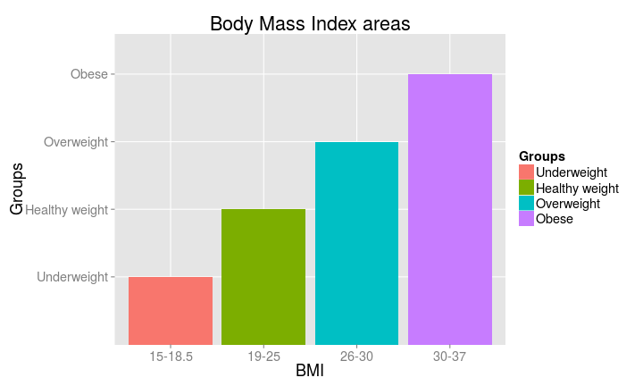

## Introduction
In the last years and especially in developed countries obesity index has increased within population. WHO has declared it as epidemic. Here are some facts:
- Worldwide obesity has nearly doubled since 1980
- In 2008, more than 1.4 billion adults, 20 and older, were overweight. Of these over 200 million men and nearly 300 million women were obese
- 35% of adults aged 20 and over were overweight in 2008, and 11% were obese
- 65% of the world's population live in countries where overweight and obesity kills more people than underweight
- More than 40 million children under the age of 5 were overweight or obese in 2012
Obesity is preventable

Thus, there is the need of analyzing whether or not you are at risk of it. Remember that obesity can induce a bunch of illnesses. This is the reason why I developed a Body Mass Index (BMI) calculator. 

---  

## BMI
The first answer of this app is to determine in which population group you are currently. For this purpose, you only need to fill the fields in the left-hand side and specifically your height and weight. In the plot, you can see the differences in the BMI groups according to the BMI values.



--- .class #id

## Basal metabolism 
The BMI calculator also measures the basal metabolism. 

It is the energy requirements when you are resting and involves a lot of physiological processes such as breathing, digesting, heart beating, neuronal connexions making and so on. 

The basal metabolism is calculated through the [Harris and Benedict equation] (http://en.wikipedia.org/wiki/Harris%E2%80%93Benedict_equation).

Although it is a way to approximate the basal metabolism, additional factors can affect it like physical activity levels or energy expended in thermogenesis. 

This is the reason why basal metabolism is so difficult to estimate.


```r
Basal <- function(weight, height, age, gender){
  if (gender == 1) {
  BasalMet <- 66.4730 + 13.751 * weight + 5.0033 * height - 6.75 * age } else {
  BasalMet <- 655.1 + 9.463 * weight + 1.8 * height - 4.6756 * age}
  BasalMet}
```

--- .class #id

## Total calories taking into account the activity level
Activity level is important since it determines extra energy consumption to maintain whatever way of life. 

People need different energy intake depending on whether they follow sedentary, low active, active or very active day-to-day. 

Calories intake based on activity level is calculated through equations from the  [Food and Nutrition Board of the Institute of Medicine of the National Academies](http://www.iom.edu/About-IOM/Leadership-Staff/Boards/Food-and-Nutrition-Board.aspx). 

As commented in the basal metabolism point, activity level influences it and this app tries to estimate both. 
